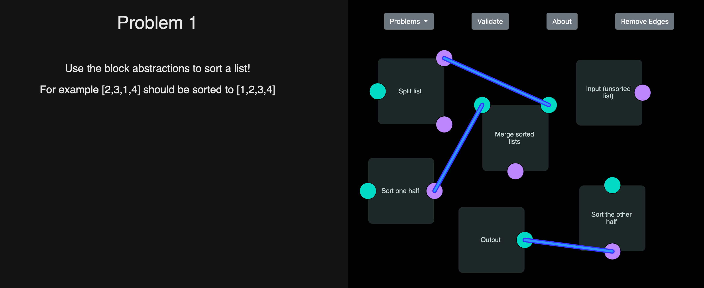

<h1 align="center">Welcome to LeetGraph!</h1>


LeetGraph is a website that allows you learn how to think with abstractions! The project is done with Vanilla JavaScript/HTML/CSS in combinations with the Bootstrap framework. 

## Links:
- [LeetGraph.tech](http://www.leetgraph.tech)
- [Devpost](https://devpost.com/software/leetgraph)

## Demo Images



## Usage

```sh
open the index.html in a browser!
```

## Authors

**Arshia Soleimani, Allen Benjamin**

* Github: [@arshiyasolei](https://github.com/arshiyasolei), [@BobbySinclusto](https://github.com/BobbySinclusto)


***